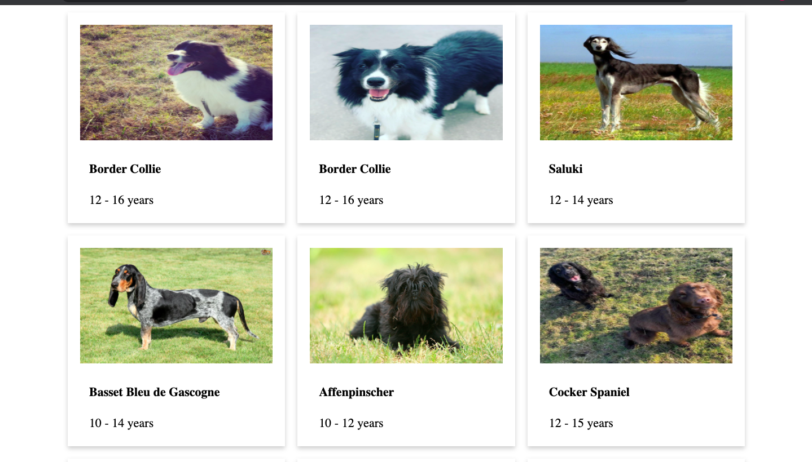
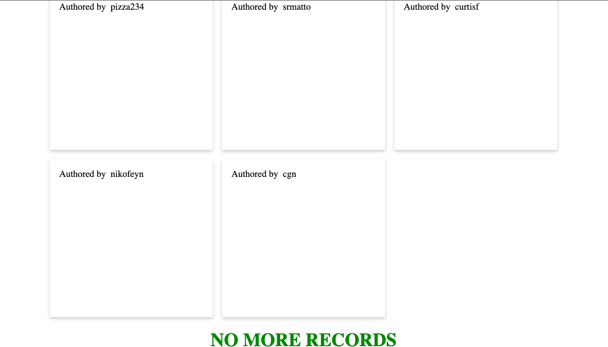
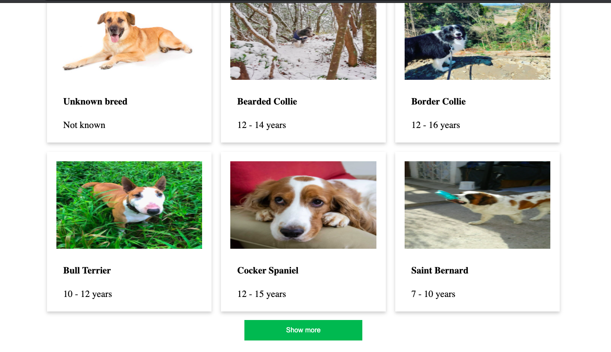

# react-infinite-data-loader

> hooks to load infinite amount of data in server side pagination
>It supports both button to load more data or just using scroll
>While passing data to this hook, please provide array name is you think that it is going to be a key , value pair then I would expect the arrayName property where you will give the value.
>if arrayName is not provided then I would assume that response is direct array of objects.


## Demo 1
[]
## Demo 2
[]
## Demo 2
[]

[](https://www.npmjs.com/package/react-infinite-data-loader) [](https://standardjs.com)

## Install

```bash
npm install --save react-infinite-data-loader
```

## Usage

```jsx
import React from 'react'

import  useInfiniteDataLoader  from 'react-infinite-data-loader'

const Example = () => {
  const {
    isLoading,
    isViewMoreLoading,
    list,
    incrementPage,
    isLast,
    useButton,
  } = useInfiniteDataLoader({ url: URL, useButton: false, arrayName: null });
  // providing url and useButton is compulsory here while arrayName is optional
  const showMore = () => {
    incrementPage();
  };

  return (
    // your logic here to display data where list being an array and others are self explanatory
  )
}
```

## License

MIT © [https://github.com/shekharramola](https://github.com/https://github.com/shekharramola)

---

This hook is created using [create-react-hook](https://github.com/hermanya/create-react-hook).
